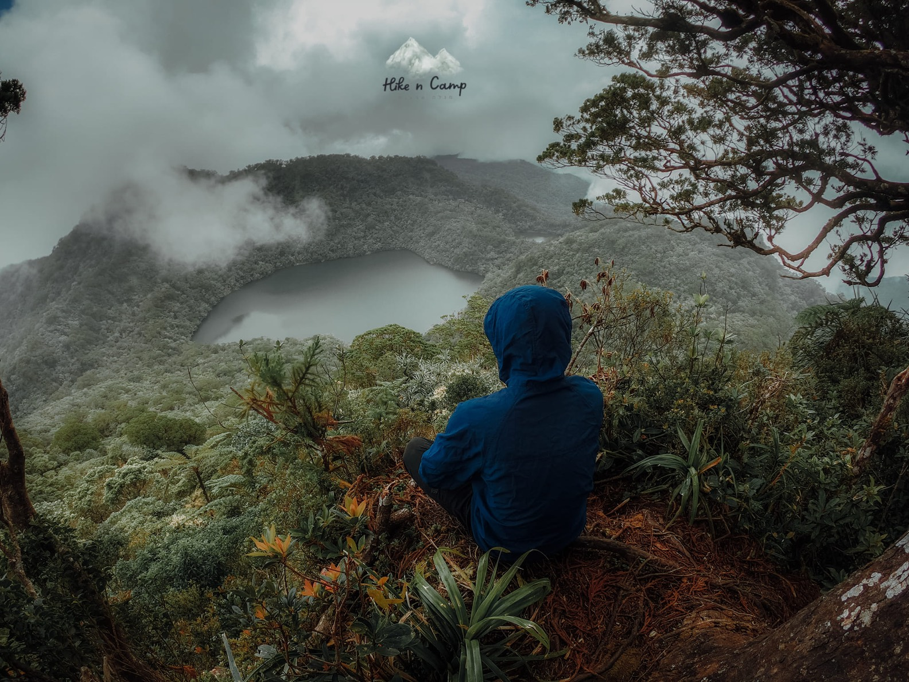

[Versión en español](./README.md)

# Hi! I'm Felipe Torres

Full-Stack Jr developer + agentic developer: I build real products by orchestrating AI agents.

## About me

- I live in San Luis Potosí, Mexico.
- Student of the **Front-end Programmer** course at EBAC — currently working on the final project.
- My working method with AI agents: I specify with spec-driven development, agents execute, I verify, test and deploy.
- I learn in public: every project is documented in its repo, decisions and mistakes included.

## 🥩 Featured project — Carni-mvp

- **Real store for Carnicería El Señor de La Misericordia**: category catalog and cart with delivery or pickup, actually in production.
- **PWA with offline support**: installable on any customer's phone and browsable without a connection.
- **Spanish-speaking virtual assistant**: guides the purchase in the customer's language, with persistent history.
- **Secure sign-up on Supabase with RLS**: role-based accounts, row-level policies and transactional orders.

Repo: [pipeTawns-x/Landingpages-Carni.pwa](https://github.com/pipeTawns-x/Landingpages-Carni.pwa) · Demo: [pipetawns-x.github.io/Landingpages-Carni.pwa](https://pipetawns-x.github.io/Landingpages-Carni.pwa/)

## 🤖 How I work

- **Spec-driven development, not vibe coding**: first I explore, propose and specify; only then code is written.
- **AI agents as a team, I decide**: agents execute the tasks; I review every change and make the final calls.
- **Every project runs on Docker with CI**: reproducible environments and pipelines with scanning before merge.
- **PRs reviewed before merge**: nothing reaches `main` without review.

## 🧰 Stack

## 📊 Activity

## 🗂️ Other projects

| Project | Description |
|---|---|
| **e-comerce** — [repo](https://github.com/pipeTawns-x/e-comerce) · [demo](https://pipetawns-x.github.io/e-comerce/) | First complete e-commerce (FrayLE Shop): catalog, cart and checkout. The foundation Carni-mvp grew from. |
| **hellodjango** — [repo](https://github.com/pipeTawns-x/hellodjango) | First contact with Python and Django on Docker. Backend learning documented in the repo README. |

## 📬 Contact

 

Thanks for reading — every project on this profile is documented and deployed.